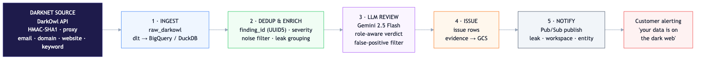
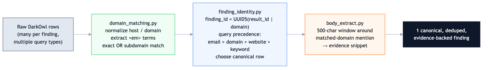
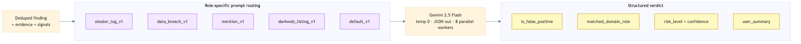

# Watching the Dark Web at Scale: A Pipeline That Tells Customers When Their Data Leaks

*How I built a Dagster pipeline that queries a darknet-intelligence API, deduplicates the noise, uses Gemini to separate real exposures from false positives, and pushes real-time alerts, so a company learns its credentials are for sale before attackers use them.*

---

> **TL;DR**
> - **Problem:** Stolen credentials, breached databases, and company mentions surface constantly on darknet markets, forums, and paste sites, buried in enormous noise and duplicates. Manually triaging it doesn't scale.
> - **Solution:** A pipeline that queries the **DarkOwl** darknet API for customer domains/keywords, deduplicates findings down to one canonical record, uses **Gemini** to assign each a *role* and filter false positives, then publishes alerts via Pub/Sub.
> - **Stack:** Python 3.12 · Dagster · dlt · Google Gemini 2.5 Flash · BigQuery/DuckDB · PostgreSQL · GCS · Cloud Pub/Sub.
> - **Outcome:** Near-real-time, low-false-positive dark-web alerts: *"your domain's credentials appeared in a stealer log on this forum."*

---

## By the numbers

~2,000customer domains monitored

~30:1raw rows collapsed per finding

~80%false positives filtered by LLM triage

&lt; 1 hrdetection → customer alert

<!-- METRICS ARE ILLUSTRATIVE of a system at this scale. Replace with your own measured
     values (Dagster asset metadata / DB COUNT queries) before publishing. -->

---

## The problem: the dark web is loud

Dark-web monitoring sounds simple, search for your company's domain, alert if it shows up. In reality it's a signal-to-noise nightmare. A single domain can match thousands of darknet records: stealer logs, breach dumps, market listings, forum chatter, paste sites. The *same* leak gets reposted across forums for months. And most matches are **incidental**, your domain mentioned in passing, not actually compromised.

The hard questions are:
1. Is this the *same* finding I already saw, just reposted? (**deduplication**)
2. Does this domain appearing here actually mean *this company* is exposed, or is it a customer's email on someone else's breached service, or pure noise? (**role classification**)
3. Is it worth waking someone up over? (**risk + false-positive filtering**)

This pipeline answers all three before anything reaches a customer.

## Architecture

Five stages, **Ingest → Dedup & Enrich → LLM Review → Issue → Notify**, take raw darknet matches and turn them into precise, customer-ready alerts.

### Stage 1, Ingest from the darknet

A **DarkOwl** API client authenticates with **HMAC-SHA1** (public/private key signing) over a proxy, and runs four query types per customer domain, `email`, `emaildomain`, `domain`, and `website_mention`, plus optional per-tenant `keyword` scans. It batches 20 domains per request, paginates results, and filters below a "hackishness" score threshold. Raw findings land in BigQuery (prod) or DuckDB (local) via **dlt**, append-only with schema evolution.

### Stage 2, Deduplication: the noise problem

This is the engineering core. One real finding arrives as many rows, across query types and reposts. Three focused modules collapse that down:

- **`domain_matching.py`** normalizes hosts (strips scheme, port, path), extracts the `<em>`-highlighted match terms from the result body, and confirms a true match, exact domain *or* subdomain, so a domain is only ever linked to a finding that genuinely mentions it.
- **`finding_identity.py`** assigns each finding a stable **`finding_id = UUID5(result_id | domain)`**, then applies **query precedence** (`email > emaildomain > domain > website_mention > keyword`) to pick a single *canonical* row when duplicates collide, keeping the highest-confidence evidence source.
- **`body_extract.py`** pulls a 500-character window around the matched-domain mention, producing a tight **evidence snippet** instead of a wall of crawled text.

Two further passes remove exact duplicates and *fuzzy* reposts (same content resurfacing on different dates), then group related findings into **leaks**. By the time data leaves this stage, thousands of raw rows have become a handful of canonical, evidence-backed findings.

### Stage 3, LLM review: role-aware triage

Deduplication tells you *what's unique*; it can't tell you *what it means*. That's the LLM's job.

Each finding is routed to a **role-specific Gemini 2.5 Flash prompt** based on its type, stealer log, data breach, dark-web mention, or market listing. The model returns a **structured JSON verdict**:

- `is_false_positive`, drop incidental noise.
- `matched_domain_role`, the key insight: is the domain the **subject** (first-party compromise), a **victim**, a **service_provider** (a customer's account *on* this domain), a **listing** (the domain itself being sold), or **incidental**? That distinction determines whether and how a customer is alerted.
- `risk_level`, `confidence`, and a plain-English `user_summary` ready to drop into an alert.

It runs deterministically (temperature 0, fixed seed, JSON-enforced) across 8 parallel workers with exponential-backoff retries. This role-classification step is what turns a noisy keyword match into an *accurate* exposure verdict.

### Stages 4 & 5, Issue creation and real-time notification

Confirmed findings become **issues**: evidence payloads are uploaded to **GCS**, and a record is upserted into the issue store. The final asset publishes a compact message, `{leak_id, workspace_id, entity_id}`, to **Google Cloud Pub/Sub**, where downstream services pick it up and alert the affected organization in near-real-time. Decoupling detection from delivery via Pub/Sub means alerting can scale and evolve independently of the pipeline.

## Orchestration

Built on **Dagster**, the seven assets run as a daily dependency chain at 01:00 UTC, with a separate **90-day backfill job** at 04:00 for onboarding new customers and historical sweeps. A `run_id` is threaded through every asset for full lineage and reproducibility, and `tenacity`-based backoff makes the external API calls resilient.

## What this project demonstrates

- **Hard deduplication & entity-resolution logic**, stable identity hashing, source-precedence resolution, normalization, and fuzzy-repost detection over genuinely messy real-world data.
- **LLM as a precision classifier**, role-aware, structured-output review that turns noisy matches into accurate, low-false-positive verdicts, with prompt routing per finding type.
- **Secure external integration**, HMAC-signed, proxied API access with batching, pagination, and rate-limit handling.
- **Event-driven architecture**, GCS evidence storage plus Pub/Sub fan-out, cleanly decoupling detection from customer alerting.
- **Multi-environment data engineering**, dlt with DuckDB locally and BigQuery + Postgres + GCS in production, all behind one config flag.

---

*Tech stack: Python 3.12 · Dagster 1.13 · dlt 1.21 (BigQuery/DuckDB) · google-genai (Gemini 2.5 Flash) · SQLAlchemy 2.0 · Google Cloud Storage · Cloud Pub/Sub · tenacity · uv.*
