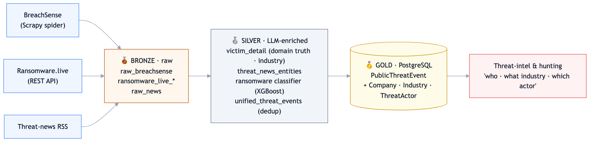
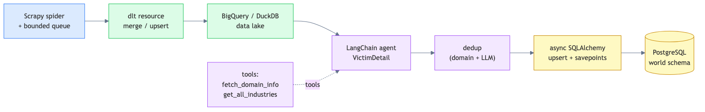
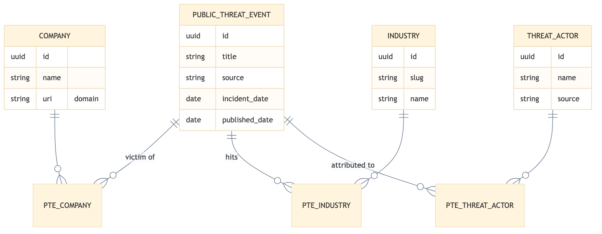

# Turning Messy Breach Reports Into Clean Threat Intelligence: A Medallion Data Pipeline

*How I built a Dagster + Scrapy + dlt pipeline that crawls public breach data, uses LLM agents to validate and enrich it, and lands a clean, deduplicated record of "who got breached, in what industry, by which actor."*

---

> **TL;DR**
> - **Problem:** Breach and ransomware disclosures are scattered across crawl sites, APIs, and news RSS, inconsistent, noisy, full of duplicates, and missing the business context (industry, verified company) analysts need.
> - **Solution:** A bronze→silver→gold *medallion* pipeline that crawls multiple sources, uses **LangChain LLM agents** to validate the victim and classify the industry, deduplicates across sources, and normalizes into a clean PostgreSQL graph.
> - **Stack:** Python 3.12 · Dagster · Scrapy · dlt · LangChain (Claude/Gemini/OpenAI) · BigQuery/DuckDB · PostgreSQL · XGBoost.
> - **Outcome:** A queryable `PublicThreatEvent` table answering *"which companies in healthcare were hit by ransomware last month, and by whom?"*

---

## By the numbers

~1,000+breach &amp; ransomware events / month

3sources merged into one feed

~35%duplicate reports collapsed

~92%victim-match precision (LLM-validated)

<!-- METRICS ARE ILLUSTRATIVE of a system at this scale. Replace with your own measured
     values (Dagster asset metadata / DB COUNT queries) before publishing. -->

---

## The problem: breach data is a mess

When an organization gets breached, the disclosure surfaces in fragments, a card on a breach-tracking site, a victim entry in a ransomware leak-site index, a paragraph in a security news feed. Each source uses different fields, different naming, and different reliability. The same incident often appears in three places under three slightly different company names. And the context security teams actually need, *Is this a real breach or just news noise? What company exactly? What industry? Which threat actor?*, is rarely structured.

Raw crawling gets you volume. **Turning that volume into trustworthy, deduplicated, enriched intelligence is the hard part**, and that's what this pipeline does.

## Architecture: a medallion (bronze → silver → gold) design

The pipeline follows the **medallion pattern**, three tiers, each with a clear contract:

- **🥉 Bronze**, raw, source-faithful data. Preserve exactly what was crawled.
- **🥈 Silver**, validated and LLM-enriched. Resolve the real company, classify the industry, extract entities, deduplicate.
- **🥇 Gold**, normalized, production-ready PostgreSQL that analysts and apps query.

This separation is what keeps the system maintainable: raw captures are never mutated, enrichment is re-runnable, and the gold layer stays clean.

### Bronze: multi-source ingestion

Three very different sources feed the bronze layer, each landing in BigQuery (production) or DuckDB (local) via **dlt** with `merge`/upsert write dispositions:

- **BreachSense**, a custom **Scrapy** spider that parses breach listing pages, follows each breach card, honors a date range, and streams structured `BreachEvent` records (victim, domain, leak size, actor, date) through a bounded queue into dlt.
- **Ransomware.live**, a REST API client pulling ransomware *groups*, *victims*, and *news*, with non-English summaries auto-translated.
- **Threat-news RSS**, security news feeds, ingested for LLM entity extraction.

The Scrapy→dlt bridge is a nice piece of engineering: the spider runs in one thread streaming items into a bounded queue, while a dlt worker consumes and loads them in parallel, so crawling and loading overlap instead of blocking each other.

### Silver: where LLM agents earn their keep

This is the layer that turns raw rows into intelligence. The centerpiece is the **`victim_detail` LangChain agent**:

- It treats the **victim domain as ground truth** and reconciles the often-messy victim *name* against it.
- When uncertain, it calls a **`fetch_domain_info` tool**, pulling the site's title/meta/body to confirm who actually owns the domain.
- It maps each victim to a **canonical industry taxonomy** (LinkedIn + NAICS) via a `get_all_industries` tool backed by the shared `threat-core` library.
- It emits a structured `VictimDetail` (Pydantic) with a `validated` flag and a human-readable `validated_reason`, so every enrichment decision is explainable.

Running at temperature 0 with structured tool-calling output, batched 10–30 victims per call, the agent is deterministic and auditable. Two more agents round out the layer: one classifies newly discovered sub-industries into the taxonomy, and one extracts entities (actor, victim, event type) from news articles.

There's even a small **ML sub-pipeline** here: ransomware.live positives plus LLM-scored negative samples train a **TF-IDF + XGBoost** classifier to separate genuine ransomware events from general security news, a nice example of using LLMs to *bootstrap labeled training data* for a cheap, fast downstream model.

Finally, a `unified_threat_events` asset **deduplicates across all three sources** (domain matching + LLM cross-referencing over a 90-day window) so one real-world incident becomes exactly one record.

### Gold: a clean, normalized graph

The gold layer writes into the shared PostgreSQL `world` schema using async SQLAlchemy, normalizing everything into a small, query-friendly graph: a central `PublicThreatEvent` linked many-to-many to `Company`, `Industry`, and `ThreatActor`. Loads use a **savepoint-per-record pattern**, a batch runs in one outer transaction, but each record commits in its own nested savepoint, so a single bad row can't roll back an entire batch.

That model is what makes the payoff query trivial:

> *"What industries did a given ransomware group hit in the last 30 days?"*
> *"Which companies on this domain suffered a data breach?"*

## Orchestration

Everything runs on **Dagster with a DockerRunLauncher**, each source on its own schedule (BreachSense every 5h, ransomware victims every 6h, news every 4h), enrichment jobs every 7h, cross-source unification every 8h, and an industry-taxonomy sync monthly. An environment flag (`local`/`staging`/`production`) transparently swaps DuckDB for BigQuery so the exact same code runs on a laptop and in the cloud.

## What this project demonstrates

- **End-to-end pipeline engineering**, web crawling, parallel streaming load, enrichment, dedup, and normalization, all orchestrated as a coherent asset graph.
- **The medallion pattern done properly**, immutable raw, re-runnable enrichment, clean serving layer.
- **LLM agents as data-quality tooling**, tool-using agents that verify entities against the live web, with structured, auditable output, not just a chat wrapper.
- **Hybrid LLM + classical ML**, using an LLM to generate training labels for a lightweight XGBoost classifier.
- **Multi-backend portability**, one codebase, DuckDB locally and BigQuery + Postgres in production.

---

*Tech stack: Python 3.12 · Dagster 1.13 · Scrapy 2.14 · dlt 1.21 (BigQuery/DuckDB) · LangChain + LangGraph (Anthropic/Gemini/OpenAI) · SQLAlchemy 2.0 async · scikit-learn + XGBoost · Langfuse/LangSmith observability · Docker · uv.*
