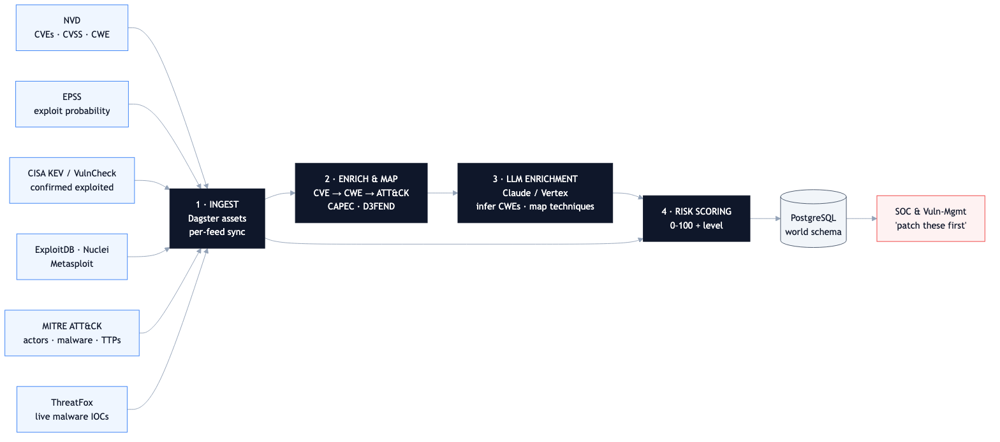
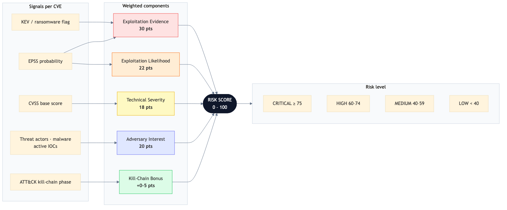
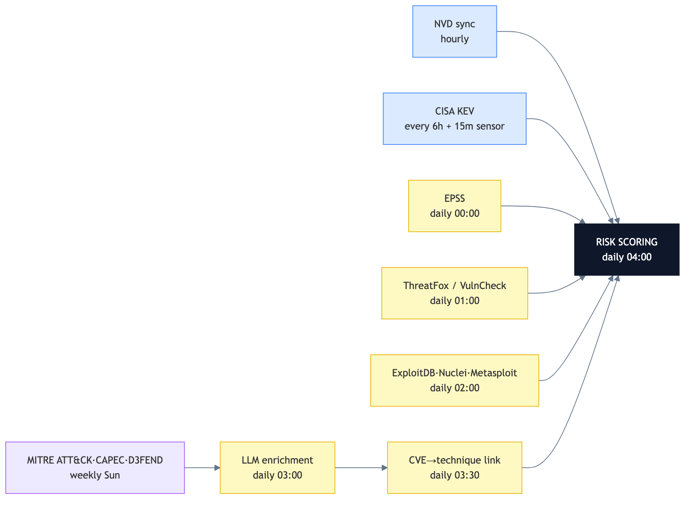
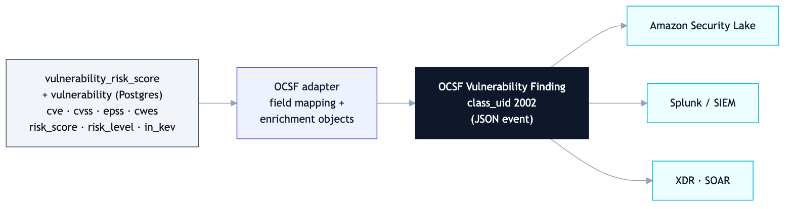

# Scoring Every Known Vulnerability: A Threat-Intelligence Data Pipeline That Tells You What to Patch First

*How I built a Dagster pipeline that fuses 12+ threat feeds into a single 0–100 risk score for ~270,000 CVEs — so security teams stop guessing and start prioritizing.*

---

> **TL;DR**
> - **Problem:** ~270k known CVEs, ~25k new per year. CVSS severity alone tells you *how bad* a vuln is in theory, not *whether anyone is actually exploiting it*. Teams drown in "critical" alerts.
> - **Solution:** A data pipeline that ingests 12+ authoritative threat feeds, links each CVE to the attacker techniques and threat actors that use it, and computes one evidence-backed **risk score (0–100)**.
> - **Stack:** Python 3.12 · Dagster · PostgreSQL 16 (async SQLAlchemy) · Claude Sonnet 4.6 (Vertex AI) · Prometheus · Docker/gRPC.
> - **Outcome:** A daily-refreshed, queryable risk table that answers *"which of my open CVEs should I patch this week?"* with a defensible, transparent score.

---

## By the numbers

<div class="stats">
<div class="stat"><span class="num">280K</span><span class="lab">CVEs scored, refreshed daily</span></div>
<div class="stat"><span class="num">12+</span><span class="lab">intelligence sources fused</span></div>
<div class="stat"><span class="num">~1,500</span><span class="lab">CRITICAL surfaced from 280K (0.5%)</span></div>
<div class="stat"><span class="num">~99%</span><span class="lab">of CRITICAL confirmed in CISA KEV</span></div>
</div>

<!-- METRICS ARE ILLUSTRATIVE of a system at this scale. Replace with your own measured
     values (Prometheus sync_records_total / llm_cost_dollars_total, or DB COUNT queries)
     before publishing — you will be asked to defend every number in interviews. -->

---

## The problem: severity is not risk

Every vulnerability management team faces the same flood. The National Vulnerability Database publishes tens of thousands of CVEs a year, most stamped "HIGH" or "CRITICAL" by CVSS. But CVSS measures *theoretical* severity — it can't tell you that **only ~5% of CVEs are ever exploited in the wild**, or that a "medium" bug is currently being weaponized by a ransomware crew.

The signal that matters — *is this being exploited, by whom, and how easily?* — is scattered across a dozen disconnected sources: NVD, EPSS, CISA's KEV catalog, MITRE ATT&CK, ExploitDB, Metasploit, ThreatFox, and more. No single feed gives you the whole picture.

**This pipeline's job: collapse all of that into one number a human can act on.**

## Architecture



The pipeline is a Dagster asset graph organized into four stages — **Ingest → Enrich → LLM-augment → Score** — landing in a PostgreSQL `world` schema that downstream SOC and vuln-management tools query directly.

### Stage 1 — Ingest: 12+ authoritative feeds

Each source is a Dagster asset with its own sync cadence, retry policy, and Prometheus metrics:

| Feed | What it contributes | Refresh |
|---|---|---|
| **NVD** | CVE metadata, CVSS (v2/3.1/4.0), CWE, affected products | hourly, incremental |
| **CISA KEV** | *Confirmed* exploited-in-the-wild catalog | 6h + a 15-min change sensor |
| **EPSS** | Daily exploit-probability score (0–1) per CVE | daily |
| **MITRE ATT&CK** | Techniques, threat actors, malware, campaigns | weekly |
| **CAPEC / D3FEND** | CWE→technique mappings, defensive mappings | weekly |
| **ExploitDB · Nuclei · Metasploit** | Public exploit / scanner / weaponized-module availability | daily |
| **ThreatFox** | Live malware IOCs from active campaigns | daily |
| **VulnCheck** | Commercial exploitation reports | daily |

The NVD asset streams 2,000 CVEs per page and syncs incrementally by `lastModDate`; a sensor watches the KEV feed every 15 minutes and fires a refresh the moment CISA publishes a new exploited vuln.

### Stage 2 — Enrich: turning a CVE into an attack story

A raw CVE is just an ID and a severity. The enrichment stage answers *"what can an attacker actually do with this?"* by walking a graph:

**CVE → CWE (weakness) → ATT&CK technique → threat actor / malware.**

CAPEC provides the CWE→technique edges; the pipeline computes the transitive closure to link each vulnerability to the concrete adversary techniques it enables, and D3FEND attaches the defensive countermeasures.

### Stage 3 — LLM enrichment: filling the gaps

Real-world data is incomplete — many CVEs ship with no CWE, and many CWEs have no CAPEC mapping. Two targeted **Claude Sonnet 4.6** (via Vertex AI) tasks close those gaps:

- **Infer missing CWEs** from the CVE's free-text description (batched 20 CVEs/call).
- **Map orphan CWEs** to ATT&CK techniques (batched 10/call), with the model's one-sentence rationale stored alongside a confidence score.

The system prompt (the CWE reference list) is cached with `cache_control: ephemeral`, and calls run with bounded concurrency and exponential backoff. The LLM is used *surgically* — only where deterministic sources fall short — which keeps cost and hallucination risk low. Every LLM-derived edge is tagged with `source = 'llm'` so it's auditable and separable from authoritative mappings.

### Stage 4 — The scoring engine

This is the heart of the system: a transparent, weighted model that converts all those signals into a single 0–100 score.



```
Risk Score (0–100) =
    Exploitation Evidence   (30 pts)   — KEV, ransomware, exploit maturity
  + Exploitation Likelihood (22 pts)   — EPSS + a KEV floor
  + Technical Severity      (18 pts)   — CVSS, linearly scaled
  + Adversary Interest      (20 pts)   — # threat actors / malware / live IOCs (log-scaled)
  + Kill-Chain Bonus        (0–5 pts)  — extra weight for initial-access techniques
```

A few design choices I'm proud of:

- **Evidence beats theory.** A CVE in CISA KEV *with* known ransomware use scores the full 30 evidence points; a mere proof-of-concept scores 10. The model rewards *confirmed* exploitation over hypothetical severity.
- **EPSS as a forward signal.** Vulnerabilities with EPSS ≥ 0.9 get inferred exploitation credit even before they hit KEV — roughly 60% of them eventually do.
- **Adversary interest is log-scaled.** The jump from 0→1 threat actor matters far more than 40→60, so counts are compressed with `log₂` to avoid letting a handful of over-reported CVEs dominate.
- **Kill-chain awareness.** An *initial-access* technique earns a +5 bonus — because a vuln an attacker can use to get in the front door is categorically more dangerous than one that needs prior access.

The output buckets cleanly: **CRITICAL ≥ 75 · HIGH 60–74 · MEDIUM 40–59 · LOW < 40** — and in practice nearly every CRITICAL-scored CVE is a confirmed KEV entry, which is exactly the validation you want.

## Orchestration: a dependency-aware daily refresh



Fast-moving feeds (NVD hourly, KEV every 6h) run independently; slow reference data (ATT&CK, CAPEC, D3FEND) refreshes weekly. Everything funnels into a single nightly **risk-scoring job at 04:00** that depends on all upstream assets — so the score always reflects the freshest available intelligence. The whole thing runs as a Dockerized gRPC code location with a separate Postgres for Dagster metadata and another for application data.

## Data model

Scores land in `world.vulnerability_risk_score` (component sub-scores preserved for explainability), joined to a rich graph: `vulnerability`, `cisa_kev`, `epss_history`, `exploit`, the `attack_*` tables (techniques, actors, malware, campaigns), `cwe_technique`, and `ioc`. Floats are stored as scaled integers, lists as native Postgres arrays, and risk scoring reads from a read-only replica connection to isolate it from ingestion load.

## Interoperability: speaking OCSF

A risk score is only useful if downstream security tooling can consume it. The serving layer maps each scored CVE to an **OCSF Vulnerability Finding** (`class_uid 2002`) — the Open Cybersecurity Schema Framework that underpins Amazon Security Lake, Splunk, and most modern security data lakes. Any OCSF-native SIEM, XDR, or data lake ingests the scored, enriched CVEs with no bespoke glue.



The mapping is direct, with the risk score and ATT&CK context carried as OCSF enrichments:

| Internal field (`vulnerability` / `vulnerability_risk_score`) | OCSF Vulnerability Finding |
|---|---|
| `cve` | `vulnerabilities[].cve.uid` |
| `cvss_score` | `vulnerabilities[].cve.cvss[].base_score` |
| `cwes[]` | `vulnerabilities[].cve.cwe[].uid` |
| `epss_score` | `vulnerabilities[].cve.epss.score` |
| `risk_score` (0–100) | `finding_info` + `risk_score` enrichment |
| `risk_level` | `severity_id` (Critical / High / Medium / Low) |
| `in_kev` | `is_exploit_available` + KEV enrichment |
| `affected_products[]` | `resources[].affected_packages` |
| linked ATT&CK techniques | `enrichments[]` (technique IDs) |

This is the difference between *a scoring service* and *a scoring service that plugs into the security data fabric a team already runs.*

<!-- Keep this section only if the OCSF adapter is actually built (or reword "maps" → "is designed to map").
     It is a high-signal addition for security-data-engineering roles. -->

## What this project demonstrates

- **Multi-source data integration** — 12+ APIs/feeds with different formats (REST, CSV.gz, STIX JSON, XML), each with bespoke incremental-sync and retry logic.
- **Pragmatic LLM use** — Claude applied *only* where deterministic data runs out, with caching, batching, confidence scoring, and full auditability.
- **A defensible domain model** — the scoring weights encode real vulnerability-management expertise (KEV, EPSS, ATT&CK, kill-chain), not arbitrary numbers.
- **Production data engineering** — Dagster asset graph, sensors, retry policies, Prometheus metrics, read replicas, and a containerized deployment.

---

*Tech stack: Python 3.12 · Dagster 1.13 · PostgreSQL 16 · SQLAlchemy 2.0 (async/asyncpg) · httpx · anthropic[vertex] · Alembic · Prometheus · Docker + gRPC code locations · uv.*
